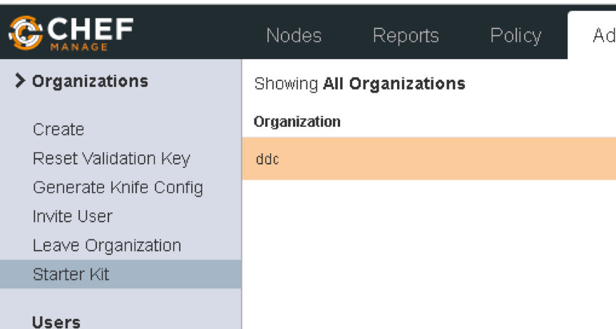
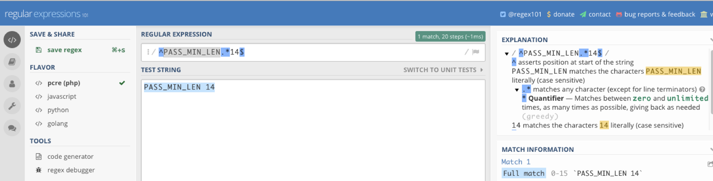
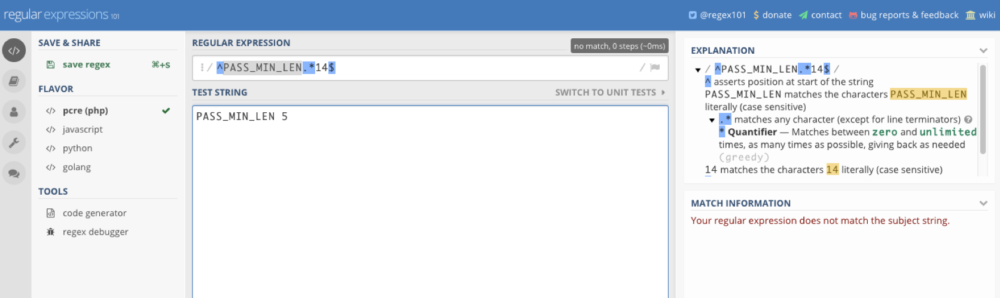

  -- ----------
     Chef Doc
  -- ----------

  -- --------------------- ---------------------
     Document Reference:   None
     Current Version:      1.0
     Version Date:         24/10/2018
     Status                Final
     Author:               Sebastien Chartrand
                           
  -- --------------------- ---------------------

Table of Contents

[1 Document Control ](#document-control)

[1.1 Document Control/Change History ](#document-controlchange-history)

[2 Bootstrap / install client ](#_Toc528659327)

[3 Chef Server user access ](#chef-server-user-access)

[3.1 List all users ](#list-all-users)

[3.2 List organization ](#list-organization)

[3.3 Create user ](#create-user)

[3.4 Starter kit ](#starter-kit)

[4 Git ](#git)

[5 Install Chef Development kit ](#install-chef-development-kit)

[5.1 Generate cookbook template ](#generate-cookbook-template)

[5.2 Create an attribute (Variable) ](#create-an-attribute-variable)

[5.3 Create a template ](#create-a-template)

[5.4 Generate recipe ](#generate-recipe)

[6 Kitchen ](#kitchen)

[6.1 Test with inspec ](#test-with-inspec)

[7 Knife and berks ](#knife-and-berks)

Document Control
================

Document Control/Change History
-------------------------------

  ------------- ------------ ------------- ---------------------
  **Version**   **Date**     **Comment**   **Editor**
  0.1           2018-06-08   Draft         Sebastien Chartrand
  1.0           2018-08-02   Final         
  ------------- ------------ ------------- ---------------------

Bootstrap / install client
==========================

<https://docs.chef.io/install_chef_air_gap.html>

\# note sudo will want to run with a password, sudoers nopass
permission, does not seem to work.

	knife bootstrap 10.10.20.55 -x UserName -P \'YourPassword\' \--sudo -N
rtx0l06

Chef Server user access
=======================

List all users
--------------

	chef-server-ctl user-list

List organization
-----------------

	chef-server-ctl org-list

Create user
-----------

	chef-server-ctl user-create UserName Sebastien Chartrand
	sebastien.chatrand\@fujitsu.com \'Mypass\'

Attach to org has an admin

	chef-server-ctl org-user-add rtx UserName --admin

Starter kit
-----------

The Starter is a preconfigure tar balled directory that has your chef
config and preconfigured. You get fetch it at this location

Ex : <https://1.1.1.1/organizations/ddc/getting_started> = <https://chefserver/organizations/orgname/getting_started>

-   Click on the Administration tab, Then your organization

Choose Starter kit

-   Then Download Starter kit

Extract the downloaded file with the utility of your likening. It will
extract a chef-repo directory.

	\[chartrse\@rtxchwk01 \~\]\$ cd chef-repo/

The hidden. chef directory is where your chef server key and knife
config resides.

	[chartrse@rtxchwk01 chef-repo]$
[chartrse@rtxchwk01 chef-repo]$ cat .chef/knife.rb
	# See https://docs.getchef.com/config_rb_knife.html for more information on knife configuration options

current_dir = File.dirname(__FILE__)
log_level                :info
log_location             STDOUT
node_name                "chartrse"
client_key               "#{current_dir}/chartrse.pem"
chef_server_url          "https://rtxlchp01.rtxlab.local/organizations/rtx"
cookbook_path            ["#{current_dir}/../cookbooks"]
[chartrse@rtxchwk01 chef-repo]$

	\[chartrse\@rtxchwk01 chef-repo\]\$ ls

cookbooks README.md roles

\[chartrse\@rtxchwk01 chef-repo\]\$

Git
===

Add all files to the commit

	git add .

Commit and comment

	git commit -m \"First commit\"

Add repository has origin in this example we used GitHub

	git remote add origin <https://github.com/aink99/chef_doc.git>

Push your change

	git push -u origin master

Add only one file commit and push

	touch foobar
	git add foobar
	git commit -m "test commit foobar"
	git push

Install Chef Development kit
============================

	sudo rpm -Uvh https://packages.chef.io/files/stable/chefdk/3.3.23/el/7/chefdk-3.3.23-1.el7.x86_64.rpm

Note there's no best practice you chose multiple cookbook with one
recipe or a cookbook with multiple recipe.

Ex you could create a cookbook per tower ex fai\_linux\_os and put
multiple Linux recipe for some linux os and another one more specific
fai\_linux\_apache

Generate cookbook template
--------------------------

Configure your get settings (Only if you have not done it before)

	git config --global user.email "sebastien.chartrand\@fujitsu.com\"

	git config --global user.name "Sebastien Chartrand

Create a directory and generate your cookbook

	mkdir chef
	cd chef
	chef generate cookbook fai\_linux\_baseline

Create an attribute (Variable)
------------------------------

This test coobook is for managing the password length in /etc/login.defs

Within your newly created cookbook generate an attribute called password

	chef generate attribute password
	cd attributes
	vi attributes/password.rb
	add the following line and save
	default['fai_linux_baseline']['password_length'] = '14'

Create a template
-----------------

Generate a template and copy or redirect the content of /etc/login.defs

	chef generate template . login.defs
	cat /etc/login.defs\>> templates/login.defs.erb

Modify the PASS_MIN\LEN like this so that it uses the attribute

	PASS_MIN_LEN    <%= node['fai_linux_baseline']['password_length'] %>

Any other change in that template file will be changed on the node.

 Generate recipe
----------------

chef generate recipe . password_policy
	cd recipes/

Edit password_policy.rb

	vim password_policy.rb

Add the following to use your template

	template '/etc/login.defs' do
  	source 'login.defs.erb'
  	owner 'root'
  	group 'root'
  	mode '0655'
	end

Has best practice include your new recipes to the default one
Edit default.rb 
vi recipes/default.rb
and add your recipe
include_recipe 'fai_linux_baseline::password_policy'

Kitchen
=======

Kitchen starts a small chef server (called chef zero )on from your chef
development kit station and , can test the change. Driver can be
hypervirtual-box(with the vagrant driver), docker etc.

In this example, we don't have any cloud based VM a so will used the
dokken driver (Docker image + systemd)

Install the docker and dokken kitchen driver

	chef gem install kitchen-docker
	chef gem install kitchen-dokken

Edit the yml file

	vi .kitchen.yml

add the following

	---
	driver:
	  name: dokken
	  privileged: true # because Docker and SystemD/Upstart
	
	provisioner:
	  name: dokken
	
	transport:
	  name: dokken
	
	verifier:
	  name: inspec
	
	platforms:
	#- name: ubuntu-18.04
	#  driver:
	#    image: dokken/ubuntu-18.04
	#    pid_one_command: /bin/systemd
	#    intermediate_instructions:
	#      - RUN /usr/bin/apt-get update
	
	- name: centos-7
	  driver:
	    image: dokken/centos-7
	    pid_one_command: /usr/lib/systemd/systemd
	
	suites:
	  - name: default
	    run_list:
	      - recipe[fai_linux_baseline::default]
	     #- recipe[test_cookbook::default]
   

Create your docker dokken image
	 
	chartrse@rtxchwk01 fai_linux_baseline]$ kitchen create
	-----> Starting Kitchen (v1.23.2)
	-----> Creating <default-centos-7>...
	       Creating kitchen sandbox at /home/chartrse/.dokken/kitchen_sandbox/8f42d15416-default-centos-7
	       Creating verifier sandbox at /home/chartrse/.dokken/verifier_sandbox/8f42d15416-default-centos-7
	       Building work image..
	       Creating container 8f42d15416-default-centos-7
	       Finished creating <default-centos-7> (0m4.33s).
	-----> Kitchen is finished. (0m8.02s)

Login to your image
	
	[chartrse@rtxchwk01 fai_linux_baseline]$ kitchen login
	[root@dokken /]# logout  
	
Converge (apply) your change (Note if you have not created your kitchen, converge will create it for you )
	
	[chartrse@rtxchwk01 fai_linux_baseline]$ kitchen converge
	-----> Starting Kitchen (v1.23.2)
	-----> Converging <default-centos-7>...
	       Creating kitchen sandbox in /home/chartrse/.dokken/kitchen_sandbox/8f42d15416-default-centos-7
	       Preparing dna.json
	       Resolving cookbook dependencies with Berkshelf 7.0.6...
	       Removing non-cookbook files before transfer
	       Preparing validation.pem
	       Preparing client.rb
	Starting Chef Client, version 14.5.33
	Creating a new client identity for default-centos-7 using the validator key.
	resolving cookbooks for run list: ["fai_linux_baseline::default"]
	Synchronizing Cookbooks:
	  - fai_linux_baseline (0.1.0)
	Installing Cookbook Gems:
	Compiling Cookbooks...
	Converging 1 resources
	Recipe: fai_linux_baseline::password_policy
	  * template[/etc/login.defs] action create (up to date)
	
	Running handlers:
	Running handlers complete
	Chef Client finished, 0/1 resources updated in 02 seconds
	       Finished converging <default-centos-7> (0m8.70s).
	-----> Kitchen is finished. (0m12.82s)

Test with inspec
----------------

Edit your recipe test
	
	vi test/integration/default/password_policy_test.rb

Add the following resource called file. Here are making sure that the line that starts with PASS_MIN_LEN then we use a world card and make sure line that end with 14

	describe file('/etc/login.defs') do
  	its('content') { should match /^PASS_MIN_LEN.*14$/ }
	end

You can test your regex on on the following site : https://regex101.com/

* Match
* 

* No Match
* 

You can now add this part to your kitchen yaml file:

	suites:
	  - name: default
	    run_list:
	      - recipe[fai_linux_baseline::default]
	     #- recipe[test_cookbook::default]
	    verifier:
	      inspec_tests:
	        - test/integration/default
	    attributes:

 

Kitchen test , builds  converge, test then destroy kitchen ex:

	chartrse@rtxchwk01 fai_linux_baseline]$ kitchen test
	-----> Starting Kitchen (v1.23.2)
	-----> Cleaning up any prior instances of <default-centos-7>
	-----> Destroying <default-centos-7>...
	       Deleting kitchen sandbox at /home/chartrse/.dokken/kitchen_sandbox/8f42d15416-default-centos-7
	       Deleting verifier sandbox at /home/chartrse/.dokken/verifier_sandbox/8f42d15416-default-centos-7
	       Finished destroying <default-centos-7> (0m11.61s).
	-----> Testing <default-centos-7>
	-----> Creating <default-centos-7>...
	       Creating kitchen sandbox at /home/chartrse/.dokken/kitchen_sandbox/8f42d15416-default-centos-7
	       Creating verifier sandbox at /home/chartrse/.dokken/verifier_sandbox/8f42d15416-default-centos-7
	       Building work image..
	       Creating container 8f42d15416-default-centos-7
	       Finished creating <default-centos-7> (0m3.86s).
	-----> Converging <default-centos-7>...
	       Creating kitchen sandbox in /home/chartrse/.dokken/kitchen_sandbox/8f42d15416-default-centos-7
	       Preparing dna.json
	       Resolving cookbook dependencies with Berkshelf 7.0.6...
	       Removing non-cookbook files before transfer
	       Preparing validation.pem
	       Preparing client.rb
	Starting Chef Client, version 14.5.33
	Creating a new client identity for default-centos-7 using the validator key.
	resolving cookbooks for run list: ["fai_linux_baseline::default"]
	Synchronizing Cookbooks:
	  - fai_linux_baseline (0.1.0)
	Installing Cookbook Gems:
	Compiling Cookbooks...
	Converging 1 resources
	Recipe: fai_linux_baseline::password_policy
	  * template[/etc/login.defs] action create
	    - update content in file /etc/login.defs from 11fa3a to a3c20f
	    --- /etc/login.defs	2016-11-04 18:24:33.000000000 +0000
	    +++ /etc/.chef-login20181029-52-7f51mg.defs	2018-10-29 18:52:35.848648200 +0000
	    @@ -23,8 +23,8 @@
	     #	PASS_WARN_AGE	Number of days warning given before a password expires.
	     #
	     PASS_MAX_DAYS	99999
	    -PASS_MIN_DAYS	0
	    -PASS_MIN_LEN	5
	    +PASS_MIN_DAYS	5
	    +PASS_MIN_LEN	14
	     PASS_WARN_AGE	7
	
	     #
	    - change mode from '0644' to '0655'
	
	Running handlers:
	Running handlers complete
	Chef Client finished, 1/1 resources updated in 02 seconds
	       Finished converging <default-centos-7> (0m13.54s).
	-----> Setting up <default-centos-7>...
	       Finished setting up <default-centos-7> (0m0.00s).
	-----> Verifying <default-centos-7>...
	       Loaded tests from {:path=>".data.home.chartrse.chef-repo.cookbooks.fai_linux_baseline.test.integration.default"}
	
	Profile: tests from {:path=>"/data/home/chartrse/chef-repo/cookbooks/fai_linux_baseline/test/integration/default"} (tests from {:path=>".data.home.chartrse.chef-repo.cookbooks.fai_linux_baseline.test.integration.default"})
	Version: (not specified)
	Target:  docker://f2391af73f083027c305ced06224641693e2babcb362e5297b1a5ec6aed7be0c
	
	  File /etc/login.defs
	     ✔  content should match /^PASS_MIN_LEN.*14/
	
	Test Summary: 1 successful, 0 failures, 0 skipped
	       Finished verifying <default-centos-7> (0m3.70s).
	-----> Destroying <default-centos-7>...
	       Deleting kitchen sandbox at /home/chartrse/.dokken/kitchen_sandbox/8f42d15416-default-centos-7
	       Deleting verifier sandbox at /home/chartrse/.dokken/verifier_sandbox/8f42d15416-default-centos-7
	       Finished destroying <default-centos-7> (0m10.93s).
	       Finished testing <default-centos-7> (0m43.73s).
	-----> Kitchen is finished. (0m46.66s)
	
	[chartrse@rtxchwk01 fai_linux_baseline]$ kitchen list
	Instance          Driver  Provisioner  Verifier  Transport  Last Action    Last Error
	default-centos-7  Dokken  Dokken       Inspec    Dokken     <Not Created>  <None>
	[chartrse@rtxchwk01 fai_linux_baseline]$
	
 Knife and berks
================

Knife ssh gets it's information from chef server. When the secure bit it set to on the node, you need to add an extra attribute. This is in order to make it harder for the attacker in case you chef server get compromise. For example,  you need to specify -a ipaddress. ohai gathers info such has IP , number of CPU and sends it to the chef server. Example the platform

	chartrse@rtxchwk01 fai_linux_patch]$ ohai |grep -i '"platform":'
	[2018-10-26T15:59:12-05:00] INFO: The plugin path /etc/chef/ohai/plugins does not exist. Skipping...
	  "platform": "oracle",
	
To upload your cookbook to your chef server use:

	[chartrse@rtxchwk01 fai_linux_baseline]$ berks upload
	Uploaded fai_linux_baseline (0.2.0) to: 'https://rtxlchp01.rtxlab.local/organizations/rtx'

If you run the command again without changing your version metadata.rb , the server will notice and won’t upload your cookbook.

	[chartrse@rtxchwk01 fai_linux_baseline]$ berks upload
	Skipping fai_linux_baseline (0.1.0) (frozen)
	[chartrse@rtxchwk01 fai_linux_baseline]$

This on reason to use berks upload over knife upload. Berks add an extra protection will knife upload could bypass it

To fetch any cookbook dependencies, use berks install:

	chartrse@rtxchwk01 chef-svrm1]$ berks install
	Resolving cookbook dependencies...
	Fetching 'chef-svrm1' from source at .
	Fetching cookbook index from https://supermarket.chef.io...
	Using chef-sugar (4.1.0)
	Using firewall (2.6.5)
	Installing hostsfile (3.0.1)
	Using chef-svrm1 (0.1.0) from source at .
	[chartrse@rtxchwk01 chef-svrm1]$

This will fetch all dependencies that are in the metadata.rb 

	[chartrse@rtxchwk01 chef-svrm1]$ grep depends  metadata.rb
	depends 'hostsfile'
	depends 'firewall'

This is how to attaches a recipe to the node (runlist) . It will be executed the next time the node performs the command chef-client

	knife node run_list add   rtxlks01 'recipe[fai_linux_baseline]'

To force a node to check and execute it’s run list perform the following command:

	knife ssh 'name:rtx0l0*'  -x UserName -P 'Password' 'sudo chef-client' -a ipaddress

You can place regex or wildcards in  'name:nodname'.  

Here are some commands to performs against the node

•	list the nodes 

	chartrse@rtxchwk01 chef-svrm1]$ knife node list
	RTXLTST01.RTXLAB.Local
	RTXLTST03.RTXLAB.Local
	RTXLTST04.RTXLAB.Local
	RTXLTST05.RTXLAB.Local
	RTXLTST06.RTXLAB.Local
	RTXLTST07.RTXLAB.Local
	RTXLTST10.rtxlab.local
	RTXLTST11.rtxlab.local
	TestNode
	rtx0l06
	rtxchwk01.rtxlab.local
	rtxlchr04.rtxlab.local
	rtxlchs01.rtxlab.local
	rtxlchw01.rtxlab.local
	rtxles01.rtxlab.local
	rtxles02.rtxlab.local
	rtxles03.rtxlab.local
	rtxlks01
	rtxltst12.rtxlab.local 

•	Show node information 

	[chartrse@rtxchwk01 chef-svrm1]$ knife node show rtx0l06
	Node Name:   rtx0l06
	Environment: _default
	FQDN:
	IP:          
	Run List:    recipe[cis-rhel], recipe[fai_linux_olscan], recipe[fai_linux_patch]
	Roles:
	Recipes:     cis-rhel, cis-rhel::default, fai_linux_olscan, fai_linux_olscan::default, fai_linux_patch, fai_linux_patch::default, cis-rhel::aide, aide::default, cis-rhel::at, cis-rhel::auditd, auditd::rules, auditd::default, cis-rhel::core_dumps, os-hardening::limits, cis-rhel::cron, cron::default, cis-rhel::firewalld, firewall::default, cis-rhel::grub, cis-rhel::kernel_modules, cis-rhel::login_banners, cis-rhel::login_defs, os-hardening::login_defs, cis-rhel::network_packet_remediation, sysctl::default, sysctl::service, cis-rhel::ntp, ntp::default, cis-rhel::pam, os-hardening::pam, cis-rhel::partitions, cis-rhel::rsyslog, rsyslog::client, rsyslog::default, cis-rhel::packages_services, cis-rhel::ssh, ssh-hardening::default, ssh-hardening::server, ssh-hardening::client, cis-rhel::sysctl, os-hardening::sysctl, sysctl::apply, cis-rhel::syslog-ng, cis-rhel::useradd, cis-rhel::minimize_access, os-hardening::minimize_access, os-hardening::suid_sgid, audit::default, audit::inspec, fai_linux_patch::rh_yumall
	Platform:    oracle 6.10
	Tags:
	

•	Delete a node

	[chartrse@rtxchwk01 chef-svrm1]$ knife node delete TestNode
	Do you really want to delete TestNode? (Y/N) N
	You said no, so I'm done here.

